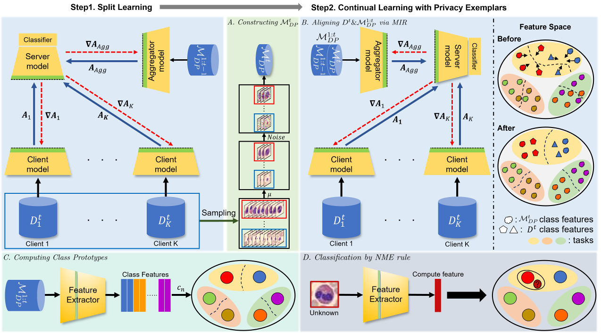

# PRCSL: A Privacy-preserving Continual Split Learning Framework for Decentralized Medical Diagnosis
This is Pytorch impelementation of "PRCSL: A Privacy-preserving Continual Split Learning Framework for Decentralized Medical Diagnosis", Jungmin Eom, Minjun Kang, Myungkeun Yoon, Nikil Dutt, Jinkyu Kim, Jaekoo Lee

## Main Architecture


## Dataset
We use MedMNIST, HAM10000, CCH5000, CIFAR100, and SVHN. Datasets should be installed at './src/data'.
Before downloading datasets HAM10000 and CCH5000, please refer to [./src/datasets](./src/datasets).
* MedMNIST: Run the command "pip install medmnist"   
* CIFAR100, SVHN: It is automatically installed when you run the train command with the relevant dataset   
* HAM10000   
    * Download dataset from https://dataverse.harvard.edu/dataset.xhtml?persistentId=doi:10.7910/DVN/DBW86T
    * To use Data augmentation, refer https://github.com/Woodman718/FixCaps/blob/main/augmentation/02_Aug_img.ipynb
* CCH5000   
    * Download dataset from https://zenodo.org/records/53169
    * After download CCH5000, you should convert the format to jpg

## Train
Run the following command to train the PRCSL Framework
```
./scripts/script_cifar100.sh <approach> <gpu> <scenario> [<results_dir>]
```
The parameters are defined as follows:
* `<approach>` - approach to be used, from the ones in `./src/approaches/`
* `<gpu>` - index of GPU to run the experiment on
* `<scenario>` - specific rehearsal scenario   
    * `base_cl`: no exemplars(centralized)   
    * `fixd_cl`: exemplars with fixed memory(centralized)   
    * `base_csl`: no exemplars(split learning)   
    * `fixd_csl`: exemplars with fixed memory(split learning)   
    * `grow_csl`: exemplars with grow memory(split learning)   
* `[<results_dir>]` - results directory (optional), by default it will be `./results`

PRCSL code structure is inspired by [FACIL](https://github.com/mmasana/FACIL/tree/master).
