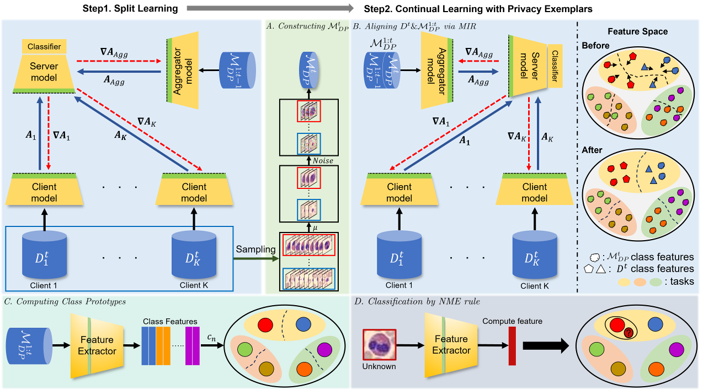

# Alleviating-Catastrophic-Forgetting-with-Privacy-Preserving-Distributed-Learning
This is Pytorch impelementation of "Alleviating-Catastrophic-Forgetting-with-Privacy-Preserving-Distributed-Learning", Jungmin Eom, Minjun Kang, Jinkyu Kim, Jaekoo Lee

## Main Architecture


## Dataset
We use MedMNIST, HAM10000, CCH5000, CIFAR100, and SVHN.   
* MedMNIST: Run the command "pip install medmnist"   
* CIFAR100, SVHN: It is automatically installed when you run the train command with the relevant dataset.   

## Train
Run the following command to train the PRCSL Framework
```
./scripts/script_cifar100.sh <approach> <gpu> <scenario> [<results_dir>]
```
The parameters are defined as follows:
* `<approach>` - approach to be used, from the ones in `./src/approaches/`
* `<gpu>` - index of GPU to run the experiment on
* `<scenario>` - specific rehearsal scenario   
    * `base_cl`: no exemplars(centralized)   
    * `fixd_cl`: exemplars with fixed memory(centralized)   
    * `base_csl`: no exemplars(split learning)   
    * `fixd_csl`: exemplars with fixed memory(split learning)   
    * `grow_csl`: exemplars with grow memory(split learning)   
* `[<results_dir>]` - results directory (optional), by default it will be `./results`